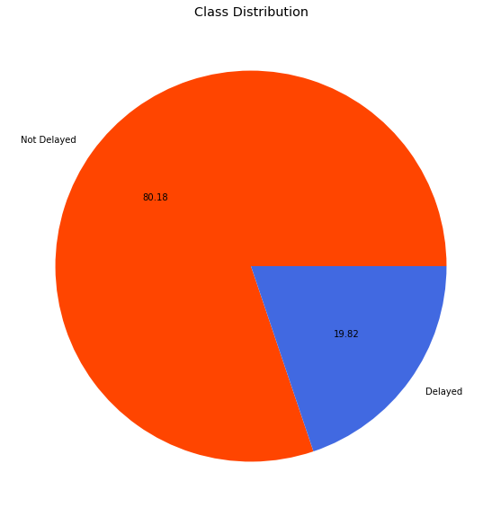

# What's My Flight Status?

**Author**: Andre Layton  
GitHub: @therookiescientist-andre

## Overview

  

## Business Problem

   The Wall Street Journal recently released their annual airline rankings report, where United Airlines dropped out of the top five. Now at \#6, due to a variety of issues including plane troubles (i.e., the Boeing 737s over the last 8 years), the company’s executive team decided to tackle the issues with growing delays to regain consumer confidence. I’ve been hired to create an algorithm that can predict flight delays, which will be deployed as an app for consumers to be able to track their flights. This is important for both the airline and potential passengers – for the airline, it will help with flight logistics and reduce fees due to delays (i.e. tarmac fees, reimbursements, etc.). For passengers, the app will allow them to make delay arrangements and take measures ahead of time, and possibly save on delay expenses. While delays are frustrating whether expected or not, United aims to use this strategy to display company honesty and gain more control over their flights.
***
## Data & Methods

   The dataset, which is available on Kaggle (the link located further below), is comprised of data provided by the Bureau of Transportation and the National Centers for Environmental Information (NOAA). It is split into two files: a CSV file containing monthly data from the year 2019 with detailed airline, weather, and airport information; and a text file containing metadata, including the column names and a brief description of each feature. Fortunately, the target variable (`'DELAYED'`) is already formed within the dataset. There are over 6 million records in the original data, and 26 features, including the aforementioned target column. However, I am only interested in those provided by United Airlines. I filter my dataset with that in mind, and reduce it to 600,000 observations. After some further data cleaning (i.e. dropping duplicates, renaming/dropping columns, OneHotEncoding, etc.), I look into the distributions of the features and the target variable. I see there is a class imbalance in my target data (as shown in the left pie plot below), so I apply undersampling techniques to even the ratio of delayed and not delayed flights (shown in the right pie plot). 
   
     [Pie Plot of the Balanced Target Variable](images/pie_plot2.png) 
   
   I end my data preparation by splitting the dataset into training, validation, and testing sets - the first two will be iterated through my modeling process.    
***
## Modeling
   I begin modeling by cross-validating four baseline models, and evaluating them based on precision, recall, and f1 scores. My main focus is to improve precision, which affects the false positive count. The false positive count, in this case, represents the amount of on-time flights predicted as delays. This is crucial because if not addressed properly, the model could spread misinformation, and lead to passengers missing their on-time flights. This would lead to further consumer disapproval, and hurt the company's sales and reputation. However, I will still track the recall score (or the amount of false negatives), and the f1 score, which is the harmonic mean of precision and recall. The baseline model with the best trio of average metric scores will be selected to undergo hyperparameter tuning and further evaluation. I will take that baseline model and tune the hyperparameters for optimal performance, then evaluate based on those optimal parameters. I also take a look into neural networks, and utilizing deep learning methods to possibly achieve the "best" model. I will use the scores and confusion matrices as performance measures to select the final model. 

   (image)

   The best determined model at predicting flight delays is the ___ . The model utilized...  As shown in the visual below...
   
   (image)
   
   Talk about 
   
***
## Results & Conclusions

***
## Links & Reproducibility
For those that would like to reproduce my analysis, or begin their own, here is a link to the original dataset, available on Kaggle:
https://www.kaggle.com/datasets/threnjen/2019-airline-delays-and-cancellations/data

***
## Repository Contents
Below is a list of the contents of this repository.

```
├── README.md             
├── images   
├── .gitignore
├── PDF_deliverables
├── separate_notebook?.ipynb                              
├── flight_status.ipynb
├── presentation.pdf                                
├── best_model.h5                               
└── 